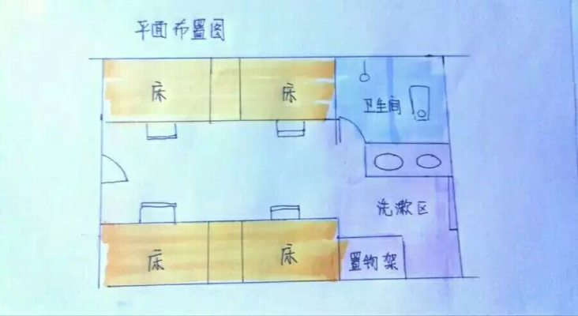
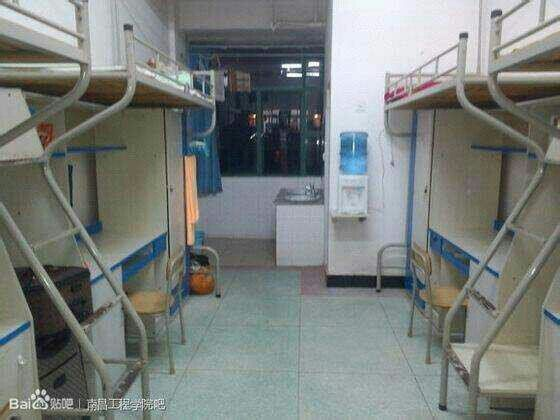

## 宿舍环境

--- 
(图源贴吧, 侵删)

 

#### 宿舍布局

#### 宿舍照片
 

 

* 宿舍四人一间
 
  
 
* 选宿舍建议: **a座双数 b座单数**(向阳)
 
  
 
* 可以找**靠谱的同班同学**说好一起选哪个宿舍 
 
  
 
* 有空调有热水器
 
  
 
* 空调去四栋租赁, 未租的宿舍空调会被拆除
 
  

* 不再允许挂床帘了
 
  
 
* 和新室友说好不要买青轴键盘! 不要半夜(连麦)打游戏! 
 
  
 
* 热水器建议不用的时候拔掉, 非常费电
 
  
 
* 一楼和当前楼层都有洗衣房有洗衣机
 
  
 
* 楼栋严查违规电器, 电吹风火锅统统藏好了 (电吹风要求600w以下才不算违规电器)
 
  
 
* 宿舍宽带配置请看 <u>**[宽带配置](/guide/wifi)**</u>
 
  
 