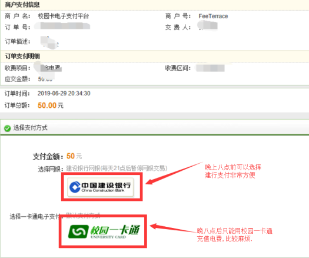

## 缴电费

---

 

#### 晚八点前
&nbsp;&nbsp;&nbsp;&nbsp; 1. 点击链接进入**南昌工程学院电子支付平台**

&nbsp;&nbsp;&nbsp;&nbsp;  <u>*http://pay.nit.edu.cn/*</u>

&nbsp;&nbsp;&nbsp;&nbsp; 2. 选择**宿舍电费**

&nbsp;&nbsp;&nbsp;&nbsp; 3. 提示登录  =>  选择类型为**学工号**；用户名为[**学号**]，密码为[**身份证后六位**]

 

&nbsp;&nbsp;&nbsp;&nbsp; 4. 填写信息，注意：房间号处需要填写**楼栋和座**(小写字母)

 

&nbsp;&nbsp;&nbsp;&nbsp; 5. 下一步  =>  付款  =>  付款  =>  晚八点前可以选择**建行支付**

 

#### 晚八点后
(有时候会碰到晚上电费用完了停电了，这时候就得跑到食堂的圈存机去将饭卡的钱存到电子账户中...然后选择上图中第二个选项，就可以充电费了。电费冲成功后，一分钟内就会来电)

##### 使用圈存机的步骤
 &nbsp;&nbsp;&nbsp;&nbsp; 1.  插入校园卡
 
 &nbsp;&nbsp;&nbsp;&nbsp; 2.  账号: [**学号**]  密码: [**学号后六位**]

 